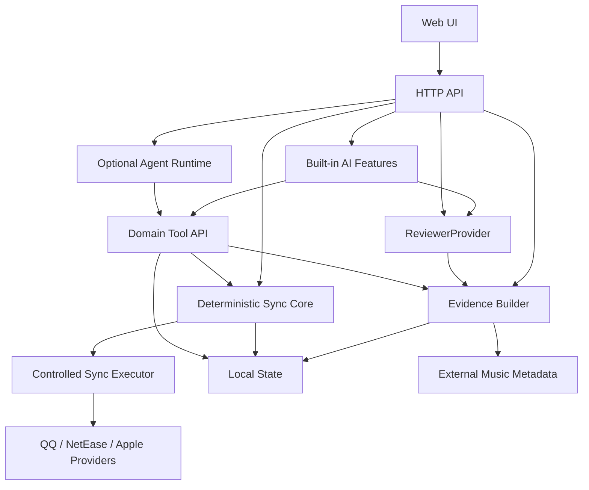

# AI Music Agent Product PRD

Last updated: 2026-07-08

## 1. 背景

`music-likes-sync` 的根本目标是让用户在任意一个音乐平台上产生的喜欢歌曲，能按用户选择的同步策略安全同步到其他平台。它不是固定的 Apple-only 工具，而是一个多平台喜欢歌曲同步引擎。

产品需要同时支持两类需求：

- 个人默认策略：以 Apple Music 的我喜欢作为唯一可信源，先同步刷新 QQ Music 和 NetEase Cloud Music，让三个平台进入一致状态。
- 开源通用策略：把 Apple Music、QQ Music、NetEase Cloud Music 都作为可选来源，按策略计算并集、删除传播、冲突复核和目标平台写入。

换句话说，Apple Music canonical mirror 是当前已实现、也最适合个人使用的策略；长期产品目标是 policy-driven sync，不是把 Apple 写死成唯一真理。

当前项目已经具备可运行的同步主链路：本地获取凭据，抓取平台快照，生成 Apple -> target 镜像计划，解析待新增曲目，干跑，分离新增和删除执行，并用本地状态记录人工决策和执行日志。普通用户产品 API 已能在 Apple canonical 策略下把选中的 QQ Music / NetEase Cloud Music 目标顺序 fan-out 到现有安全执行器。下一阶段需要把 AI 引入到两个层级：

- 识别增强：降低跨平台曲目匹配、版本判断、重复判断里的人工成本。
- 音乐智能：基于用户真实喜欢记录，提供音乐喜好画像、歌曲推荐、相似歌曲发现和自然语言分析。

本 PRD 定义产品目标、已实现现状、体验设计、AI/Agent 架构边界、前后端实现路线和验证标准。

配套设计文档：

- `docs/UX_FLOW_SPEC.zh-CN.md`：普通用户五屏交互设计与确认清单。
- `docs/TECH_STACK_DECISION.zh-CN.md`：前端、后端、AI 与 Agent 技术栈决策。
- `docs/PRODUCT_ROADMAP.md`：面向实现的分阶段 roadmap 与验证门槛。

## 2. 产品定位

### 2.1 一句话定位

一个本地优先、可开源、自带安全审计链路的多平台喜欢歌曲同步与音乐智能工具。

### 2.2 核心原则

- 同步策略必须显式选择；不能隐式把某个平台当作永远正确。
- 个人默认策略是 Apple Music canonical source；开源产品必须支持多源并集同步。
- 同步核心必须确定性可测试，AI 只能给建议，不能绕过同步执行器直接写入平台。
- 删除永远是显式确认动作，不能由 AI 自动触发。
- 凭据、曲库快照、AI 输入输出、运行日志默认只在本地。
- 支持 DeepSeek、Hermes、本地模型、OpenAI 等多 provider，但产品能力不能被单一 provider 绑定。
- 开源发布必须避免提交 cookies、`.env`、本地快照、报告和浏览器 profile。

### 2.3 同步策略模型

产品需要把“同步”抽象成策略，而不是固定代码路径。

策略一：`canonical_mirror`

- 适合用户明确指定一个平台为唯一可信源。
- 例子：Apple Music 是 source of truth，QQ Music 和 NetEase Cloud Music 是 mirror targets。
- source-only track 会新增到 targets。
- target-only track 会被标记为 remove，但删除仍需要显式确认。
- 当前代码库的 mirror plan 属于这个策略。

策略二：`union_convergence`

- 适合用户希望“我在哪个平台喜欢过，就同步到其他平台”。
- 所有启用平台的 liked tracks 先合并成 canonical union。
- 某个平台缺少 union 内曲目时，生成 add。
- 删除需要 tombstone / deletion policy，不能简单把某个平台缺失理解成删除意图。
- 这是开源产品的核心长期策略。

策略三：`managed_bidirectional`

- 适合希望新增和删除都能跨平台传播的高级用户。
- 系统记录每个平台的上次同步基线，比较本次 snapshot 与 baseline 的差异。
- 新增可以进入 union。
- 删除需要判断是用户主动删除、平台缺失、抓取失败还是匹配失败。
- 删除传播必须经过风险分流、AI/人工复核和显式确认。

策略四：`read_only_analysis`

- 适合只做画像、推荐、相似歌曲和同步评估，不写入任何平台。
- Music Agent 默认使用这个策略。

## 3. 目标用户

### 3.1 多平台音乐用户

用户可能在 Apple Music、QQ Music、NetEase Cloud Music 任意平台听歌和喜欢歌曲，希望这些喜欢记录最终出现在其他平台。

核心诉求：

- 不想手工维护多平台喜欢列表。
- 希望“在哪个平台喜欢过”都能进入统一收藏。
- 不希望误删目标平台歌曲。
- 希望看到同步计划，而不是把账号交给黑盒脚本。

### 3.2 Apple canonical 用户

用户长期使用 Apple Music 作为主库，希望以 Apple Music 为唯一可信源刷新其他平台。当前你的个人需求属于这一类：先用 Apple Music 清洗和刷新三个平台，然后让后续跨平台新增进入自动同步机制。

核心诉求：

- Apple Music 当前状态必须能覆盖 QQ Music 和 NetEase Cloud Music。
- 刷新后三个平台应进入一致基线。
- 之后任意平台新增喜欢歌曲，都应该同步到其他平台。
- 删除传播需要比新增更谨慎，必须有明确策略和确认。

### 3.3 高质量曲库整理用户

用户关注歌曲版本、现场版、remix、feat、翻唱、日文罗马音、繁简体、平台别名等问题，希望 AI 帮忙判断，但最终能保留人工可控权。

核心诉求：

- 减少逐条比对。
- 能看见 AI 为什么判断为同一首或不同版本。
- 能批量确认，但出现风险信号时自动降级成人工复核。

### 3.4 音乐发现用户

用户希望基于自己的真实喜欢记录生成口味画像，找相似歌曲，发现可能喜欢的新歌。

核心诉求：

- 推荐要解释得通，最好能说明相似点。
- 能围绕某首歌提问，例如“找几首和这首氛围接近但更偏电子的歌”。
- 推荐结果可以回流到同步工具，例如加入一个候选列表或导出。

## 4. 当前已实现现状

本节描述当前代码库已经实现或基本具备的能力。它不是用户本地私有数据报告，不包含 raw snapshots 或账号信息。

### 4.1 本地凭据与平台连接

已实现：

- Apple Music 支持 CSV / TSV / TXT / JSON 导入，也支持通过本地浏览器捕获页面里的 liked songs。
- QQ Music 支持本地 Edge 专用 profile 登录，后台轮询 `qq.com` cookies，保存归一化 cookie，并自动刷新 QQ 快照。
- QQ Music 已有 `GET /api/qq/playlists`，可以列出当前账号可见歌单的脱敏 id 信息，帮助定位 `dirid` / `tid`。
- NetEase Cloud Music 支持 QR login，后端创建二维码，前端展示扫码状态，确认后保存 cookie 并刷新快照。
- `.env` / 环境变量支持 AI provider key，本地 `.env` 被隐私规则排除在公开产物外。

仍需改进：

- QQ Music 原始 QR polling 是否能拿到等价的写入凭据尚未作为默认模式，需要真实验证后再决定是否替代浏览器捕获。
- Apple Music 更理想的获取方式需要继续评估。当前导入和浏览器捕获可用，但还不是完整官方授权体验。
- 凭据健康状态需要产品化展示，例如“可读”“可写”“过期”“只能读取歌单 id”。

### 4.2 Apple-source-of-truth 镜像同步

已实现：

- `src/mirror-sync.js`：确定性的 Apple -> target mirror plan。
- `src/mirror-resolve.js`：对 `add` 候选做目标平台 catalog search 和解析。
- `src/mirror-apply.js`：干跑和真实执行，且新增与删除路径分离。
- `src/workflow.js`：文件状态编排，保存 plan、runs、decisions 和 AI suggestions。
- `src/server.js`：提供 mirror plan、resolve、dry-run、apply、convergence、review decision 等 HTTP API。
- 普通用户 `/api/sync/*` 在 Apple canonical 下支持多目标新增执行、按目标删除确认和聚合返回；在 union / managed policy plan 下已有 ready-add 受控执行第一片，managed 下已有 confirmed-tombstone 删除 dry-run / execution 路径，并能在真实 policy 写入后刷新目标快照和重建当前 preview。
- 普通用户 baseline / tombstone API 已支持保存当前三端基线、读取 baseline diff 摘要、记录单条或批量删除意图处理动作；页面发起的 baseline 保存必须绑定已收敛的当前预览，避免把未完成同步固化成后续删除判断基线。Apple canonical 刷新收敛后，保存基线可以自动启用 `managed_bidirectional`，让后续新增自动同步、删除继续走 tombstone 确认。
- 普通用户预览列表已提供删除意图处理按钮：忽略、仅当前平台、恢复、当前页批量处理非破坏性决策、确认全局删除。确认全局删除需要输入明确确认文本，并且保持逐条确认。
- CLI mirror 命令和 Web UI 操作面板。
- 手工 review decisions 支持单条和批量，保存后可从快照重建 plan，决策可审计、可逆。
- 镜像执行有 `runId`、`idempotencyKey`、operation keys、running checkpoint、completed / failed 状态和恢复语义。
- convergence check 可在执行后刷新 target snapshot，重新生成 plan，确认是否还有 add/remove/review 差异；普通用户 `/api/sync/convergence` 和页面一致性卡片已能展示 skipped dry-run、open delta、converged、refresh failed 等状态。

当前已实现策略的动作定义：

- `keep`：目标平台已有可信匹配。
- `add`：Apple 有、目标平台缺失，需要解析到目标平台 track 后才能执行。
- `remove`：目标平台有、Apple 不再需要，必须带可删除的目标 id，且需要显式确认。
- `review`：确定性匹配不足，版本、重复、反向匹配或风险信号需要复核。

仍需改进：

- 现有实现还不是完整的多源并集同步；真实写入主要覆盖 Apple canonical mirror 的 QQ / NetEase 目标 fan-out，union / managed 目前推进到 ready-add 受控执行、managed confirmed-delete 受控执行、post-write preview refresh、baseline、tombstone 状态生命周期和首版单条 / 批量删除意图复核 UI。
- 需要引入 sync baseline、platform diff、union set、tombstone 和 deletion policy。
- 当前仍可能出现大量 `review` 和 `target_catalog_not_resolved`，需要更好的证据聚合和 AI 复核。
- UI 中同步工作台、历史运行、AI 复核和推荐能力会逐渐拥挤，需要重新整理信息架构。
- 需要更多真实 QQ / NetEase disposable playlist 的 add/remove 验证证据。

### 4.3 元数据与识别证据

已实现：

- Apple 导出中的 ISRC 已进入识别链路。
- `src/metadata/musicbrainz.js` 支持通过 MusicBrainz 查询外部 metadata。
- `src/evidence.js` 聚合 `external_evidence.musicbrainz`、`match_evidence`、duration delta、ISRC relation、alias overlap、version cue conflicts、support signals、risk signals。
- `src/sync-ai.js` 和 `src/ai-review.js` 已把外部证据和匹配证据放入 AI payload。
- `src/mirror-sync.js` 在镜像计划中保留 alias 和 compact MusicBrainz metadata。
- `src/transliterate.js` 使用 OpenCC 完整词典统一简繁体，并结合平台 / MusicBrainz 别名、假名与罗马音生成匹配变体；确定性评分与 AI 证据复用同一套变体。
- `src/match.js` 已加入录音指纹：标准化标题和专辑精确一致、时长差不超过 2 秒、无版本冲突且无不同 ISRC 时可自动匹配；同一源命中多个指纹候选仍留在复核队列。
- `src/mirror-sync.js` 会在同一艺人键内跨歌曲复用已由平台 / MusicBrainz 提供的显式艺名别名，不根据模型记忆扩散别名。
- 版本风险按当前标题与专辑发行信息分别提取，支持中英日常见 `live`、`cover`、`instrumental`、`remix` 等提示；历史别名和普通专辑名称不会被误当成当前版本结论。
- `test/match.test.js` 与 AI evaluation fixtures 已覆盖简繁体、艺名别名、日文转写、Apple storefront 本地化艺名、候选排序、不同 ISRC 和版本冲突边界。

仍需改进：

- 外部音乐数据库目前以 MusicBrainz 为主，还没有形成 provider-agnostic evidence registry。
- 平台返回字段不稳定，QQ / NetEase 很多候选没有 ISRC，需要更强的 fallback evidence。
- 现有黄金集仍以合成公开样本为主，需要继续加入脱敏后的真实跨语言、同曲不同版本和错误候选案例。

### 4.4 AI 复核

已实现：

- DeepSeek JSON review 调用可通过 UI 或 `.env` 提供 key。
- 写入候选 AI 复核已支持 batch review、suggestion 保存和应用。
- Mirror AI 已支持对 `review` 操作生成建议，建议动作为 `keep`、`separate`、`needs_human`。
- AI suggestion 应用支持 confidence threshold。
- 不安全的 `keep` 会被 safety downgrade 到 `needs_human`，避免 AI 直接放行高风险匹配。
- 前端已有 Mirror AI panel，可选择模型、batch size、apply threshold、覆盖策略和 consent。
- `src/ai-provider.js` 已提供 DeepSeek-compatible JSON chat provider 抽象，现有写入候选、mirror 和 sync AI review 复用同一请求入口。
- `/api/ai/provider` 已支持保存非密钥 provider 偏好；API key 只来自本地 `.env` / 环境变量或一次性显式传入，不写入 state。
- `/api/ai/provider/test` 已支持在显式 consent 后验证 provider 的严格 JSON 输出能力，不保存 API key，也不回传 raw provider payload。
- 普通用户 AI 助理页已有 consent-gated provider 自检控件：未勾选同意时不能测试，测试结果只展示 provider、model、JSON 能力和 token usage 摘要。
- `/api/ai/explain` 已能基于 sync preview 的脱敏证据生成普通用户解释；默认使用确定性本地解释，只有显式 consent 后才调用模型。
- `/api/ai/tombstones/analyze` 已能把 deletion signals 按未处理、已确认全局删除、恢复、仅当前平台和已忽略分组；默认本地分析，模型批量分析同样需要显式 consent，且不能创建确认删除。
- `/api/ai/profile` 已支持本地 deterministic 画像和 consent-gated 模型增强画像；发送给模型的是聚合后的 profile evidence，不包含 Cookie、原始快照或 provider raw payload。
- `/api/ai/recommend` 已支持本地 deterministic 推荐和 consent-gated 模型增强总结 / 候选重排；发送给模型的是聚合画像摘要和本地候选 evidence，模型只能重排已有候选，不能创造新歌或执行写入。

仍需改进：

- AI prompt 和返回 JSON schema 需要进一步稳定，避免 provider 返回非严格 JSON 导致批处理失败。
- AI 复核还需要更完整的可观测工具调用轨迹、证据引用、评测集和跨轮推理能力。
- AI 建议目前已经覆盖“是不是同一首”“为什么进入这个同步动作”“聚合画像如何解释”和“如何重排推荐候选”；更丰富的“推荐什么”仍需要更大的黄金集、真实 provider 输出对比和用户反馈标签。

### 4.5 开源与验证基础

已实现：

- `docs/PRODUCT_ROADMAP.md`：同步产品路线。
- `docs/PROVIDERS.md`：provider 凭据、API surface 和 troubleshooting。
- `docs/STATE.md`：本地状态 schema 和 migration policy。
- `docs/VALIDATION.md`：本地、CI、package、Docker、live validation gates。
- `npm test`、`npm run check:syntax`、`npm run check:state`、`npm run check:privacy`、`npm run smoke:http`、`npm run smoke:web-app`、`npm run smoke:react-ui`、`npm run smoke:agent-mcp`、`npm run smoke:ui`、`npm run smoke:package`、`npm run smoke:fresh-install` 等自动化验证。
- npm package whitelist、隐私 smoke、fresh install smoke、Docker smoke、strict release evidence checker。

仍需改进：

- AI/Agent 还需要持续扩大 golden set、真实 provider 输出对比和真实 Hermes workflow 证据。
- AI 输入可能包含私有曲库信息，需要更明确的数据最小化和 redaction 策略。

## 5. 问题定义

### 5.1 同步识别的问题

跨平台歌曲同步的难点不是简单字符串匹配。实际问题包括：

- 同一首歌在不同平台标题不同，例如繁简体、罗马音、别名、标点差异。
- 同一 recording 在不同平台专辑名不同。
- 同一歌曲有现场版、伴奏版、remix、cover、feat、explicit、radio edit 等版本。
- QQ / NetEase 的候选可能缺少 ISRC 或 duration。
- 用户不希望因为 AI 自信地误判导致删除或错过新增。

### 5.2 体验问题

当前用户必须理解 plan、resolve、dry-run、review、apply、convergence 等工程概念。对开发者可接受，但对开源用户不够友好。

需要改进为：

- 用户先选择同步策略：Apple canonical、并集同步、托管双向同步或只读分析。
- 用户只做必要决策，系统默认完成证据收集和风险分流。
- 高风险动作清晰阻断。
- AI 的价值体现在减少 review 数量，而不是制造更多需要理解的状态。

### 5.3 删除传播的问题

新增传播相对简单：某个平台新增喜欢歌曲后，系统可以把它加入统一集合，再补到其他平台。删除传播复杂得多，不能简单把“某个平台没有这首歌”当成删除意图。

需要区分：

- 用户主动在某个平台取消喜欢。
- 平台接口暂时没返回。
- 歌曲匹配失败。
- 歌曲被平台下架或换 id。
- 用户希望只清理某个平台，而不是全局删除。

因此，多源同步必须引入 baseline 和 tombstone：

- `baseline`：上次成功同步后三个平台的一致视图。
- `platform_diff`：本次各平台相对 baseline 的新增和删除。
- `tombstone`：用户确认过的全局删除意图。
- `deletion_policy`：删除是否传播、传播到哪些平台、是否需要二次确认。

### 5.4 高级音乐智能的问题

用户真正长期需要的不只是同步，还包括：

- 我喜欢的音乐有什么结构化画像。
- 最近喜欢的歌和长期喜欢有什么变化。
- 某首歌为什么像另一首歌。
- 能否推荐一些同风格但不在我库里的歌。
- 能否和一个懂我曲库的 Agent 对话。

这类能力需要工具化数据访问、外部音乐证据、推荐候选生成和可解释输出，不适合塞进一次性的同步判断 prompt。

## 6. 产品目标与非目标

### 6.1 近期目标

- 把当前 Apple canonical mirror 明确沉淀为第一种同步策略。
- 设计并实现 sync baseline、union set、platform diff 和 deletion policy 的状态模型。
- 把 AI 复核升级为证据增强、可审计、可评估的识别工作台。
- 把人工 review 数量显著降低，同时保持误合并和误删风险受控。
- 为 Hermes 或其他 Agent runtime 预留 provider adapter，但不把同步核心绑定到某个 Agent 框架。
- 把 AI 输入、输出、应用和人工覆盖纳入状态 schema 和测试。

### 6.2 中期目标

- 支持多平台并集同步：任一启用平台新增喜欢歌曲，都能补到其他平台。
- 支持可配置删除传播：默认谨慎、显式确认、高风险阻断。
- 提供 Music Agent chat，用自然语言解释同步判断、曲库结构和推荐理由。
- 生成用户音乐喜好画像。
- 支持“找相似风格歌曲”和“生成推荐候选列表”。
- 推荐结果可转为候选 playlist，但写入仍走明确确认。

### 6.3 非目标

- 不做无基线、无策略的盲目三端互相覆盖。
- 不做无确认自动删除。
- 不把私有 cookies、曲库快照或 AI payload 上传到公共服务端。
- 不在 v1 承诺官方 Apple Music 全量授权写入。
- 不把 Hermes 作为开源用户必须安装的硬依赖。

## 7. 信息架构

建议把 Web UI 从“所有功能平铺”调整为四个主区域。

### 7.1 Setup

目的：低成本完成三端连接和健康检查。

内容：

- Apple Music：导入、浏览器捕获、最新快照时间、track count、ISRC coverage。
- QQ Music：扫码或浏览器登录、cookie 状态、可读/可写状态、歌单 id 列表。
- NetEase Music：QR login、cookie 状态、可读/可写状态、歌单列表。
- Sync policy：选择 Apple canonical、并集同步、托管双向同步或只读分析。
- AI provider：本地 `.env` 状态、临时 key 输入、provider 测试。

关键交互：

- 每个平台显示连接状态，不直接暴露 cookie。
- QQ 和 NetEase 登录成功后自动刷新 snapshot。
- QQ 歌单 id 面板保留，帮助定位 writable `dirid`。

### 7.2 Sync Workbench

目的：完成核心同步。

内容：

- policy selector：Apple canonical、union convergence、managed bidirectional、read-only analysis。
- source / target selector：在 Apple canonical 下选择唯一 source 和多个 targets；在 union 下选择参与平台。
- plan summary：keep / add / remove / review / blocked / ready。
- action rail：generate plan、resolve adds、dry-run、execute additions、execute deletions、convergence check。
- operation table：按 add/remove/review/blocked/ready 过滤。
- delete confirmation modal：展示 destructive count；单目标输入 `DELETE FROM QQ` / `DELETE FROM NETEASE`，多目标输入 `DELETE FROM SELECTED TARGETS`。
- baseline status：展示上次一致基线、各平台新增、各平台删除和未确认 tombstones。

关键交互：

- 默认只推荐下一步动作。
- 删除动作永远是独立主按钮，并且默认不可执行。
- dry-run 结果和 convergence 结果必须在 UI 上形成闭环。
- 切换策略前必须提示当前 plan 会失效，避免把 Apple canonical 的删除计划误用于 union 策略。

### 7.3 AI Review

目的：让 AI 帮用户处理不确定匹配，减少人工 review。

内容：

- 待复核队列：高风险优先，例如 duration mismatch、version cue conflict、弱 alias。
- 证据卡片：source track、target track、duration、ISRC、MusicBrainz、alias、risk signals。
- AI 建议：keep / separate / needs_human、confidence、reason、evidence references。
- 批量应用：只允许应用高置信且无阻断风险的建议。
- 人工覆盖：用户可把 AI 建议改为 keep、separate 或清空。

关键交互：

- AI 先展示建议，不自动改 plan。
- 用户点击 apply 后才写入本地 decision state。
- 被 safety downgrade 的条目必须解释风险原因。

### 7.4 Music Intelligence

目的：把同步工具升级为懂用户曲库的音乐助理。

内容：

- Taste Profile：语言、年代、风格、情绪、能量、常见 artist、版本偏好、最近变化。
- Similar Tracks：以某首歌为 seed，找相似歌曲。
- Recommendations：基于 profile 和 seed 生成候选，标注是否已存在于 Apple / QQ / NetEase。
- Agent Chat：自然语言问答，例如“我最近是不是更偏日语摇滚？”、“找 20 首适合夜跑的歌，不要我已经喜欢过的”。

关键交互：

- 推荐结果默认是候选，不自动写入任何平台。
- 每个推荐都必须带解释和证据来源。
- 用户可以把推荐保存为 local shortlist，之后再选择导出或写入目标平台。

## 8. 关键用户流程

### 8.1 个人默认流程：Apple 刷新三端

1. 用户打开本地 Web UI。
2. 用户选择 `canonical_mirror` 策略。
3. 用户选择 Apple Music 作为唯一可信源。
4. 用户导入或捕获 Apple Music liked songs。
5. 用户扫码或浏览器登录 QQ / NetEase。
6. 系统展示三个平台连接健康状态。
7. 系统生成 Apple -> QQ 和 Apple -> NetEase 的 mirror plans。
8. 系统自动解析 add candidates。
9. 系统对 review items 运行 AI review。
10. 用户确认 AI 建议和剩余人工项。
11. 用户执行 dry-run。
12. 用户先执行 additions。
13. 用户确认删除风险后执行 deletions。
14. 系统刷新所有平台，运行 convergence check。
15. 系统保存新的三端一致 baseline，作为后续自动同步基线。

### 8.2 开源通用流程：多源并集同步

1. 用户打开本地 Web UI。
2. 用户选择 `union_convergence` 策略。
3. 用户选择参与平台，例如 Apple、QQ、NetEase。
4. 系统展示三个平台连接健康状态。
5. 系统拉取各平台 snapshot。
6. 系统基于 track identity 和 AI evidence 生成 unified liked set。
7. 系统为每个平台生成补齐计划。
8. 系统把无法确定的匹配放入 AI Review。
9. 用户确认高风险项。
10. 系统执行 dry-run。
11. 用户确认后执行 additions。
12. 系统刷新所有平台，保存新的 baseline。

### 8.3 托管双向同步：新增与删除传播

1. 用户打开 UI。
2. 系统检查凭据健康和快照新鲜度。
3. 系统读取上次一致 baseline。
4. 系统比较本次 snapshot 与 baseline，计算各平台新增和删除。
5. 平台新增默认进入 union，并补到其他平台。
6. 平台删除进入 tombstone review，不自动传播。
7. 用户选择删除策略：只从当前平台删除、全局删除、忽略、恢复。
8. 系统生成 add/remove plan。
9. 用户执行 dry-run。
10. 用户确认后执行 additions 和受确认保护的 deletions。
11. 完成后展示 convergence 状态并更新 baseline。

### 8.4 AI 复核

1. 系统展示 review 队列。
2. 用户点击 AI review。
3. 后端为每个候选构建 evidence bundle。
4. AI 返回 structured suggestions。
5. 后端做 schema validate 和 safety downgrade。
6. 前端展示建议和风险。
7. 用户批量应用高置信建议，逐条处理剩余项。
8. plan rebuild，summary 更新。

### 8.5 喜好画像

1. 用户进入 Music Intelligence。
2. 系统基于启用平台的 liked songs、unified set 和可用 metadata 生成 profile。
3. Agent 可调用本地 profile、外部 metadata 和平台 search。
4. UI 展示 profile summary、可解释特征和最近变化。
5. 用户可追问或用 profile 生成推荐。

### 8.6 相似歌曲与推荐

1. 用户选中一首 track 作为 seed。
2. 系统构建 seed evidence：metadata、artist、duration、ISRC、MusicBrainz、aliases、用户上下文。
3. Agent 生成相似维度，例如旋律、节奏、情绪、语言、年代、编曲、vocal 风格。
4. 系统查询外部/平台 catalog，排除已喜欢曲目。
5. Agent 生成候选排序和解释。
6. 用户保存候选或导出。

## 9. AI 与 Agent 设计

### 9.1 设计决策

同步核心不应该变成 Agent。原因：

- 同步需要稳定、可测试、可重放。
- 删除和写入必须由明确的 executor 控制。
- 开源用户的运行环境差异很大，不能要求所有人安装同一个 Agent 框架。

建议实现：

- 产品内置 AI 是主线，面向普通用户提供同步判断、删除风险解释、音乐画像、相似歌曲和推荐。
- Agent 工具是增强入口，面向 Hermes、本地 Agent、MCP 或外部自动化，复用同一套证据和同步工具。
- 两者共享底层 evidence builder、catalog search、profile、recommendation 和 draft plan 能力。
- 真正新增、删除、确认同步的动作只能回到受控 sync executor，不能由 Agent 直接调用 provider mutation。
- 自研一个轻量 `MusicIntelligenceProvider` / `ReviewerProvider` 抽象。
- DeepSeek JSON reviewer 继续作为默认低门槛 provider。
- Hermes 作为可选 adapter，适合本机已有 Hermes 且希望使用工具型 Agent 的用户。
- 未来可接 OpenAI、本地模型或其他 provider。

### 9.1.1 内置 AI 与 Agent 工具边界

产品不应该把 Agent 作为普通用户的前置条件。普通用户看到的是清晰的产品动作，而不是模型、工具和上下文管理。

内置 AI 负责：

- 同步复核：判断跨平台候选是否是同一首、不同版本或需要人工确认。
- 删除解释：解释为什么某首歌会出现在“可能删除”里。
- 音乐画像：总结用户喜欢歌曲的语言、风格、年代、情绪和变化。
- 相似歌曲：围绕某首 seed track 找相似候选并解释原因。
- 推荐候选：生成可保存的推荐列表，但不自动写入平台。

Agent 工具负责：

- 暴露只读或受控写入工具给 Hermes / MCP / 外部 Agent。
- 支持自然语言追问，例如“为什么这 51 首需要确认？”。
- 允许 Agent 查证据、查 catalog、生成建议、生成同步草稿。
- 让高级用户把本项目变成个人音乐 Agent 的工具箱。

Agent 禁止：

- 直接新增或删除平台歌曲。
- 直接读取或修改 cookies。
- 绕过同步预览、删除确认和 dry-run。
- 绕过本地隐私和 consent 策略发送整份曲库。

因此最终架构是：内置 AI 保证产品可用性，Agent 工具保证高级可扩展性。

### 9.1.2 产品取舍结论

这部分需要进入 PRD，并作为后续实现边界：我们不在“自带 AI”和“给 Agent 提供工具”之间二选一，而是采用双层架构。

- 普通用户默认使用内置 AI 能力。用户只看到同步复核、删除解释、音乐画像、相似歌曲和推荐，不需要理解 Agent、MCP、工具调用或上下文管理。
- 高级用户可以把同一套能力暴露给 Hermes / MCP / 外部 Agent。Agent 适合自然语言追问、批量解释、个性化推荐和跨工具自动化。
- 内置 AI 与 Agent 共享同一套 evidence builder、catalog search、profile、recommendation、draft plan 和 safety policy，避免两套判断逻辑产生不一致。
- Agent 只能生成解释、建议、shortlist 或待确认草稿；真实 add/delete 仍必须回到普通同步预览、dry-run、live validation 和显式确认。
- 开源发布必须保证没有 Agent runtime 时产品仍完整可用；Hermes 是增强适配器，不是运行前提。

### 9.2 分层架构



### 9.3 Provider 抽象

`ReviewerProvider` 负责同步识别建议：

```ts
type ReviewAction = 'keep' | 'separate' | 'needs_human';

interface ReviewerProvider {
  reviewMirrorCandidates(input: {
    target: 'qq' | 'netease';
    operations: MirrorReviewOperation[];
    evidence: EvidenceBundle[];
    policy: ReviewPolicy;
  }): Promise<ReviewSuggestion[]>;
}
```

`MusicAgentProvider` 负责高级音乐智能：

```ts
interface MusicAgentProvider {
  answer(input: {
    messages: AgentMessage[];
    tools: AgentToolSpec[];
    context: MusicUserContext;
    policy: AgentPolicy;
  }): Promise<AgentAnswer>;
}
```

### 9.4 Agent 工具

Agent 不直接读写 cookies，不直接调用 destructive provider mutation。它只使用项目暴露的 domain tools。

只读工具：

- `get_library_summary`
- `get_track_evidence`
- `get_sync_policy`
- `get_sync_plan`
- `get_baseline_diff`
- `get_review_queue`
- `search_target_catalog`
- `lookup_musicbrainz`
- `get_taste_profile`
- `find_similar_tracks`
- `explain_match_decision`

受控写入工具：

- `save_ai_suggestions`：保存建议，不改变 provider。
- `save_local_shortlist`：保存推荐候选。
- `draft_sync_operations`：生成待确认操作。

禁止 Agent 直接调用：

- `execute_sync_deletions`
- `execute_sync_additions`
- legacy `execute_mirror_*` mutation endpoints
- provider raw cookie mutation APIs

真实写入只能由受控 sync executor 在用户确认后执行。

### 9.5 Evidence Bundle

每个 AI 判断必须收到结构化证据，而不是只收到标题和歌手。

建议字段：

- `source_track`：当前判断中的来源平台 track normalized fields。
- `target_track`：当前判断中的目标平台 candidate normalized fields。
- `identity`：ISRC、provider ids、MusicBrainz recording ids。
- `text_match`：title similarity、artist similarity、alias overlap、transliteration match。
- `duration`：source duration、target duration、delta seconds、risk level。
- `version_cues`：live、remix、cover、instrumental、explicit、radio edit、feat。
- `external_evidence`：MusicBrainz result、aliases、release relation。
- `library_context`：target candidate 是否已经在目标库中，是否和其他 source tracks 冲突。
- `risk_signals`：阻断或降级原因。
- `support_signals`：支持 keep 的理由。

### 9.6 Safety Policy

AI 建议必须经过后端安全归一化：

- duration mismatch 超过阈值时，`keep` 降级为 `needs_human`。
- source / target 出现冲突 version cue 时，`keep` 降级为 `needs_human`。
- AI confidence 低于 apply threshold 时不自动应用。
- 缺少关键证据时不允许高置信自动 keep。
- `separate` 可以把 review 拆成 add/remove，但 remove 仍需要 delete confirmation。
- 所有 AI 应用写入 `mirror-decisions.json`，带 `aiAppliedAt` 和 batch id。

## 10. 前端需求

### 10.1 Setup 页面

功能需求：

- 显示每个平台连接状态。
- 显示最近 snapshot 时间和 track count。
- 显示 Apple ISRC coverage 和 MusicBrainz coverage。
- QQ 登录成功后展示可选歌单 id 列表。
- NetEase QR 状态展示等待扫码、已扫码待确认、已登录。
- AI provider 测试按钮，验证 key、模型和 JSON output 能力；按钮必须先勾选 consent，且 UI 不展示 key 或 raw response。

验收标准：

- 新用户不需要手动复制 cookie 就能完成 NetEase 登录。
- QQ 默认流程不要求用户打开 DevTools。
- 所有凭据内容在 UI 中脱敏。

### 10.2 Sync Workbench

功能需求：

- 展示当前 sync policy、参与平台、source / target 关系和下一步推荐动作。
- plan summary 需要标明 destructive count。
- union 策略需要展示每个平台相对 baseline 的新增、缺失和待确认删除。
- resolve add 后展示候选、置信度、失败原因和 alternatives。
- 低置信新增候选允许用户接受当前候选、选择备选或跳过；当前可见候选支持批量接受或批量跳过，但备选项仍需逐条选择。接受后仍只进入受控新增执行，不直接写入平台。
- dry-run 结果需要拆分 add/remove/review/blocked。
- execution 结果需要展示 provider verification 和 convergence 入口。

验收标准：

- Apple canonical 策略下，Apple 不能被选为 mirror target。
- union 策略下，Apple 可以是参与平台，但删除传播必须遵守 deletion policy。
- 没有 dry-run 或 confirmation 时不能执行删除。
- 删除确认 modal 里展示目标平台、playlist id、待删除数量和 exact confirm phrase。

### 10.3 AI Review

功能需求：

- 可配置 provider、model、batch size、apply threshold。
- consent 文案明确说明会把曲目信息发送给 AI provider。
- 展示每条建议的 action、confidence、reason、evidence references、safety flags。
- 支持批量应用高置信建议。
- 支持筛选：all、keep suggested、separate suggested、needs human、downgraded、low confidence。

验收标准：

- AI review 失败不会破坏已有 plan 和 manual decisions。
- 应用 AI suggestions 后 plan summary 自动刷新。
- 被降级条目不能进入批量自动 keep。

### 10.4 Music Intelligence

功能需求：

- Profile overview：展示语言、年代、艺术家、情绪、能量、风格和最近变化。
- Seed track selector：从 Apple liked songs 或 mirror plan 中选一首歌。
- Similar tracks：展示候选、相似维度、证据和是否已存在。
- Recommendations：支持按场景、语言、年代、风格、排除条件生成候选。
- Agent Chat：支持围绕个人曲库自然语言问答。

验收标准：

- 推荐结果不会自动写入平台。
- 每个推荐至少有一个解释维度和一个来源。
- 可以排除已喜欢歌曲。
- 可以保存本地 shortlist。

## 11. 后端需求

### 11.1 新模块建议

建议新增或整理以下模块：

- `src/sync-policy.js`：同步策略定义、策略校验和 plan orchestration。
- `src/sync-baseline.js`：三端一致 baseline、platform diff 和 tombstone 管理。
- `src/sync-union.js`：多源并集集合构建和 platform gap 计算。
- `src/ai-provider.js` / future `src/ai/providers/`：DeepSeek-compatible provider abstraction、Hermes adapter、future providers。
- `src/ai/schema.js`：所有 AI request / response schema validation。
- `src/agent/tools.js`：Agent 可调用的 domain tools。
- `src/profile.js`：taste profile 生成。
- `src/recommend.js`：recommendation candidate generation and ranking。
- `src/evidence-registry.js`：MusicBrainz 和未来外部音乐数据库的统一 evidence registry。

### 11.2 API 设计

AI 识别：

- `POST /api/mirror/ai/review`
- `POST /api/mirror/ai/apply`
- `GET /api/mirror/ai/suggestions`
- `GET /api/ai/provider`
- `POST /api/ai/provider`
- `POST /api/ai/profile`
- `POST /api/ai/explain`
- `POST /api/ai/tombstones/analyze`
- `POST /api/ai/provider/test`

策略化同步：

- `GET /api/sync/policies`
- `POST /api/sync/plan`
- `POST /api/sync/resolve`
- `POST /api/sync/dry-run`
- `POST /api/sync/apply-additions`
- `POST /api/sync/apply-deletions`
- `POST /api/sync/convergence`
- `GET /api/sync/baseline`
- `POST /api/sync/baseline/save`
- `POST /api/sync/tombstones`

音乐画像：

- `POST /api/profile/generate`
- `GET /api/profile`
- `POST /api/profile/refresh-metadata`

相似歌曲：

- `POST /api/recommend/similar`
- `POST /api/recommend/by-profile`
- `POST /api/recommend/save-shortlist`
- `GET /api/recommend/shortlists`

Agent：

- `POST /api/agent/chat`
- `GET /api/agent/tools`
- `GET /api/agent/sessions/:id`

### 11.3 状态文件

建议新增 schema-versioned state：

- `data/sync-policy.json`
- `data/sync-baseline.json`
- `data/sync-plan.json`
- `data/sync-tombstones.json`
- `data/sync-runs.json`
- `data/mirror-ai-suggestions.json`
- `data/ai-provider-state.json`
- `data/music-profile.json`
- `data/recommendation-shortlists.json`
- `data/agent-sessions.json`

要求：

- 所有 state 文件必须有 `version`。
- AI payload 原文默认不保存，除非用户开启 debug。
- 如果保存 debug payload，必须在 `data/debug/` 下并被 privacy smoke 排除。
- shortlist 可以保存推荐 track metadata，但不保存 cookies。

### 11.4 Observability

新增指标建议：

- sync policy selected count。
- baseline save / stale / invalid count。
- platform diff add / delete count。
- tombstone created / confirmed / ignored count。
- AI review batch success / failure count。
- AI strict JSON parse failure count。
- safety downgrade count。
- suggestions applied count。
- manual override after AI count。
- review reduction ratio。
- recommendation accepted / saved count。

## 12. 数据与隐私

### 12.1 数据分类

本地敏感数据：

- cookies。
- `.env` 和 AI API key。
- raw provider snapshots。
- full AI prompt / response。
- playlist ids、track ids、user ids。

可公开数据：

- 源码。
- 文档。
- 示例 CSV。
- 脱敏 validation summary。
- schema 和测试 fixtures。

### 12.2 AI 数据最小化

默认发送给 AI provider 的数据只应包括判断必需字段：

- 标题、歌手、专辑、时长、ISRC、候选 metadata。
- 外部证据摘要。
- 风险信号和支持信号。

默认不发送：

- cookies。
- 用户 id。
- playlist id。
- 完整曲库。
- raw provider response。

Music Agent 需要全局口味分析时，应发送聚合 profile 或抽样摘要，而不是整份 raw snapshot。只有在用户明确同意时，才允许更大的上下文上传。

## 13. 评估指标

同步识别指标：

- union convergence gap count。
- baseline drift count。
- confirmed tombstone count。
- manual review reduction ratio。
- AI suggestion apply rate。
- safety downgrade precision。
- false keep rate。
- false separate rate。
- add resolution success rate。
- post-sync convergence success rate。

体验指标：

- 首次完成连接时间。
- 首次成功 dry-run 时间。
- 首次完成 add/remove round trip 时间。
- 每次同步需要人工处理的条目数。

音乐智能指标：

- profile generation success rate。
- recommendation save rate。
- similar-track click/save rate。
- 用户对推荐的 thumbs up/down 或 manual feedback。

## 14. 测试与验证计划

### 14.1 单元测试

必须覆盖：

- sync policy validation。
- union set construction。
- baseline diff。
- tombstone lifecycle。
- evidence bundle 构建。
- AI response schema validation。
- safety downgrade。
- provider adapter fallback。
- profile feature extraction。
- recommendation ranking deterministic parts。
- Agent tool permission boundary。

### 14.2 Contract 测试

必须覆盖：

- `/api/sync/plan` Apple canonical、union convergence、managed bidirectional。
- `/api/sync/baseline/save` schema validation。
- `/api/sync/tombstones` single confirm / ignore / restore / current-platform-only and batch non-destructive decisions。
- `/api/sync/convergence` ordinary-user convergence summary and persisted `sync-preview.convergence`。
- `/api/mirror/ai/review` 成功、失败、partial failure。
- `/api/mirror/ai/apply` threshold、overwrite、低置信跳过。
- `/api/profile/generate` 不存在 snapshot、存在 snapshot、metadata 缺失。
- `/api/recommend/similar` seed 缺失、已存在排除、候选为空。
- `/api/agent/chat` 工具调用只读边界。

### 14.3 UI Smoke

必须覆盖：

- Sync policy selector、baseline status、union diff 和 tombstone review。
- AI Review panel 在 desktop 和 mobile 不溢出。
- consent 未勾选时不能调用外部 AI。
- AI 建议渲染、筛选、批量应用。
- Music Intelligence 空状态、profile 状态、recommendation shortlist。
- 删除确认仍然独立工作，不被 AI UI 混淆。

### 14.4 Live Validation

必须覆盖：

- QQ disposable playlist add/remove round trip。
- NetEase disposable playlist add/remove round trip。
- 登录凭据获取后能读取目标歌单列表。
- 推荐和 AI 复核不执行 provider mutation。

### 14.5 AI Evaluation

已建立测试专用数据集，并通过 `npm run check:ai-eval` 运行本地可重复评估。首版曲目匹配黄金集 `test/fixtures/ai-eval/track-match-cases.json` 覆盖：

- same recording。
- same song different version。
- different song same title。
- remix / live / cover。
- Japanese / Chinese transliteration。
- missing ISRC。
- duration conflict。
- different ISRC。

每个曲目匹配样例包含人工 label。模型输出类 fixture 还包括：

- `test/fixtures/ai-eval/profile-model-cases.json`：画像总结、标签、confidence 和 evidence refs。
- `test/fixtures/ai-eval/recommendation-model-cases.json`：推荐候选重排、禁止凭空造歌、证据引用和隐私词过滤。
- `test/fixtures/ai-eval/explanation-model-cases.json`：普通用户解释的风险级别、推荐动作、证据引用和越权动作过滤。
- `test/fixtures/ai-eval/tombstone-model-cases.json`：删除信号分组、风险级别、显式确认要求、受控删除执行边界，以及未确认全局删除建议的负例。

AI provider 输出不能作为唯一真值；后续模型接入必须把模型结果与这套黄金集、真实 provider 输出和人工反馈标签对齐，再决定是否扩大自动应用范围。

## 15. Roadmap

### Phase 0: 已完成基础

状态：基本完成。

范围：

- Apple-source-of-truth mirror plan，也就是当前 `canonical_mirror` 策略的第一版实现。
- QQ / NetEase credential acquisition。
- provider snapshots。
- add resolve、dry-run、add/delete execution。
- manual decisions。
- convergence check。
- MusicBrainz evidence。
- DeepSeek-based write / mirror AI review。
- Built-in AI provider abstraction and deterministic sync-item explanations。
- AI evaluation fixtures and local no-model evaluation gate for track matching, profile summaries, recommendation reranking, explanations, and tombstone risk outputs。
- open-source validation gates。

### Phase 1: 策略化同步基础

目标：把当前 Apple mirror 代码升级为 policy-driven sync core，并为并集同步建立可靠状态模型。

工作项：

- 新增 `sync-policy` 策略定义：`canonical_mirror`、`union_convergence`、`managed_bidirectional`、`read_only_analysis`。
- 让现有 Apple -> target mirror plan 成为 `canonical_mirror` 的实现，而不是唯一产品模型。
- 新增 `sync-baseline`，保存三端一致基线。
- 新增 `sync-union`，从多平台 snapshots 生成 unified liked set。
- 新增 `platform_diff`，识别每个平台相对 baseline 的新增和删除。
- 新增 `sync-tombstones`，记录用户确认的全局删除意图。
- 新增 `sync-runs`，把 union / managed policy 执行历史从 Apple mirror 诊断日志中拆出来。
- 新增 `/api/sync/*` 策略化 API，同时保留 `/api/mirror/*` 作为兼容路径。
- 前端新增 policy selector、baseline status、union diff 和 tombstone review。
- 更新 `docs/STATE.md`、`docs/VALIDATION.md`、`docs/PRODUCT_ROADMAP.md`。

验收：

- 现有 Apple canonical 同步行为不回退。
- 可以从三端 snapshots 计算 union set 和每个平台缺口。
- 删除不会因为单个平台缺失而自动传播。
- baseline 和 tombstone state validation 通过。

### Phase 2: AI 识别产品化

目标：让 AI review 从实验功能变成可信工作流，并服务于 canonical mirror 和 union convergence 两种策略。

工作项：

- 固化 `mirror-ai-suggestions` state schema。
- 把 AI response schema validation 独立出来。
- 增强 evidence card UI。
- 扩展 provider test 故障诊断文案和高级设置入口。
- 加入 AI review metrics。
- 扩展 AI evaluation fixtures，接入真实 provider 输出对比、tombstone 风险真实样本和用户反馈标签。
- 把 AI review 纳入 HTTP smoke 和 UI smoke。
- 更新 `docs/STATE.md`、`docs/VALIDATION.md`、`docs/PRODUCT_ROADMAP.md`。

验收：

- AI review 失败不影响同步核心。
- 高风险 keep 会被稳定降级。
- 批量应用后 plan 可重建且 state validation 通过。

### Phase 3: Agent provider 抽象与 Hermes / MCP adapter

目标：给高级 AI 能力打基础，但不牺牲开源可运行性。

工作项：

- 新增 `ReviewerProvider` 和 `MusicAgentProvider` interface。
- 把 DeepSeek 实现迁移到 provider adapter。
- 已实现 `music-likes-sync agent-mcp` stdio MCP adapter，支持 Hermes / 外部 Agent 调用本项目只读 domain tools。
- 已补充 Hermes / MCP 配置示例：`docs/AGENT_MCP_SETUP.zh-CN.md`。
- 已实现本地 sanitized tool traces：记录 source、status、duration、arguments summary、result summary 和 evidence refs，不保存 raw prompt、raw seed title / artist、Cookie、API key 或 provider raw payload。
- 普通用户 AI 页面已支持自然语言本地工具问答：用户可以询问曲库、同步证据、baseline 差异、复核队列、画像或推荐候选，页面显示路由到的安全工具、只读 / 本地草稿状态、摘要和 evidence refs。
- 普通用户 AI 页面已展示脱敏 Agent 工具审计，可刷新最近工具调用，只显示工具、状态、来源、耗时、摘要计数和 evidence refs。
- 普通用户 AI 页面已支持对单次 Agent trace 标记短反馈：有帮助、证据不足、不准确；不保存自由文本反馈。
- Agent 工具默认只读。
- 增加 provider capability detection。
- UI 支持选择 provider。

验收：

- 没有 Hermes 时项目照常运行。
- Hermes / MCP 客户端可以读取曲库摘要、同步预览、单曲证据、baseline 差异、复核队列、画像、相似歌曲和推荐草稿。
- 普通用户页面可以调用 `/api/agent/chat`，但结果仍然只来自受权限门禁保护的只读 / 本地草稿工具。
- Agent 不能直接执行 add/delete。
- Agent session trace 可通过 `GET /api/agent/sessions` 和普通用户 AI 页面做本地审计；短反馈通过 `POST /api/agent/trace-feedback` 保存。

### Phase 4: 音乐喜好画像

目标：让用户理解自己的音乐偏好。

工作项：

- 生成 `music-profile.json`。
- 聚合语言、年代、artist、album、duration、metadata、alias、外部 evidence。
- 支持按时间窗口对比。
- 前端新增 Music Intelligence profile view。
- AI 可解释 profile summary。

验收：

- 无 AI key 时可生成基础 deterministic profile。
- 有 AI key 时可生成自然语言解释。
- profile 不保存敏感凭据。

### Phase 5: 相似歌曲与推荐

目标：从同步工具扩展为个人音乐发现工具。

工作项：

- seed track similar finder。
- profile-based recommendation。
- external metadata enrichment。
- target catalog search and de-dup against Apple liked songs。
- local shortlist。
- feedback capture。

验收：

- 推荐默认不会写入平台。
- 推荐结果能解释相似点。
- 用户可以保存 shortlist，并导出或后续手动同步。

### Phase 6: Music Agent Chat

目标：自然语言操作和解释。

工作项：

- Agent chat session state。
- 工具调用 trace。
- 可解释同步判断。
- 曲库问答。
- 推荐追问。
- 操作草稿生成。

验收：

- 用户可以问“为什么这两首被判定不同？”并看到 evidence。
- 用户可以问“找类似这首但更轻快的歌”并得到候选。
- Agent 生成的写入动作只进入 draft，不直接执行。

## 16. 风险与对策

### 16.1 AI 误判

风险：AI 把不同版本误判为同一首。

对策：

- safety downgrade。
- confidence threshold。
- evidence card。
- evaluation fixtures。
- 删除路径保持独立确认。

### 16.2 Provider API 不稳定

风险：QQ / NetEase Web API 字段和行为变化。

对策：

- live validation。
- provider troubleshooting docs。
- adapter contract tests。
- write result 以后验 snapshot 为准。

### 16.3 隐私泄漏

风险：AI payload、cookies 或 snapshots 被提交或分享。

对策：

- privacy smoke。
- data minimization。
- debug payload 默认关闭。
- `.env` 和 `data/` 持续忽略。
- 文档明确 issue redaction。

### 16.4 Hermes 绑定

风险：开源用户没有 Hermes，导致产品不可用。

对策：

- Hermes 是 optional adapter。
- `agent-mcp` 是 stdio 可选入口，不影响 Web UI、CLI 和同步核心。
- 自研 provider interface。
- DeepSeek / mock provider 保持基础能力可测试。

## 17. 开放问题

- Apple Music 最低成本、最可靠、最适合开源的凭据/导出方案是什么。
- QQ Music 原始 QR polling 能否稳定获取写入所需 cookie。
- MusicBrainz 之外是否需要引入 AcousticBrainz、ListenBrainz、Spotify metadata 或其他音乐数据库。
- 推荐能力是否需要本地 embedding store，还是先用 metadata + LLM ranking。
- Music Agent 是否要支持多轮长期记忆，还是只保存 session-local context。
- 推荐结果是否要支持写入 Apple Music 之外的目标平台候选歌单。

## 18. 成功标准

Phase 1 成功标准：

- AI review 成为同步主流程的一部分，但同步核心仍可无 AI 运行。
- 用户能明显减少人工 review。
- 所有 AI suggestions 都可审计、可撤销、可重建。
- 本地测试、HTTP smoke、UI smoke、privacy smoke 均覆盖 AI 主路径。

Phase 3-5 成功标准：

- 用户能看到可信的音乐喜好画像。
- 用户能以某首歌为 seed 找到可解释的相似推荐。
- 用户能和 Music Agent 对话，但所有写入平台动作仍需要明确确认。
- 项目仍保持 local-first、open-source-ready、provider-agnostic。
